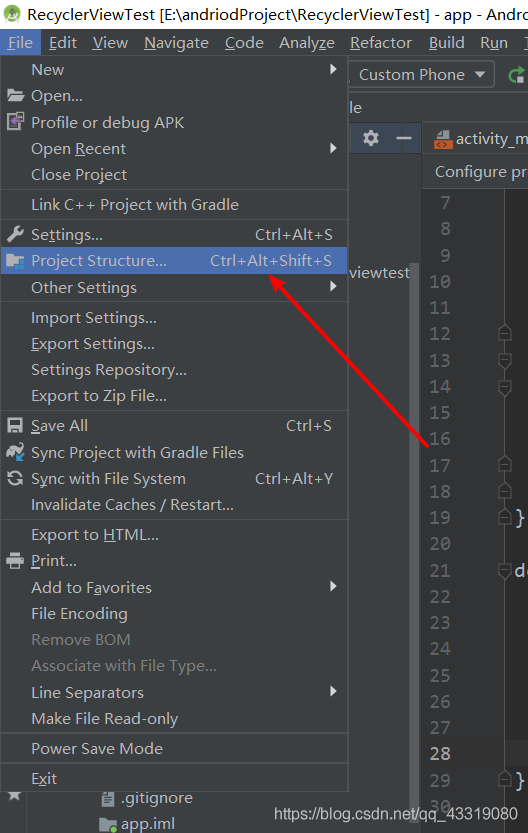
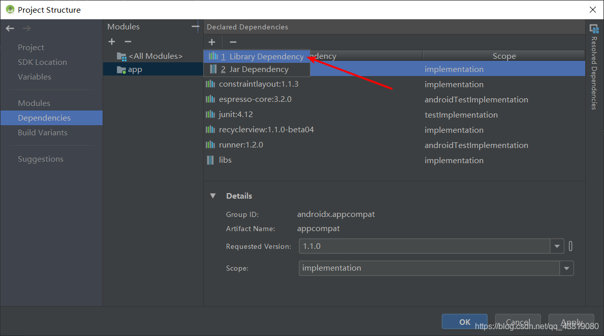
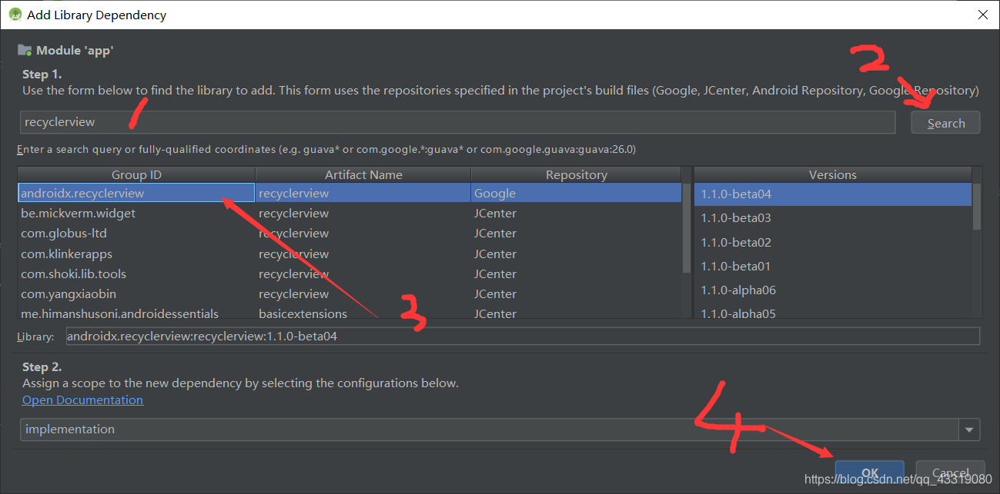
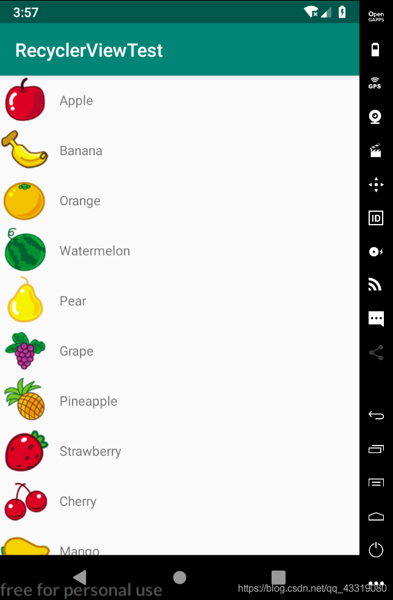

# 基于sdk28使用Android Studio创建RecyclerView实例，使用androidx导入recyclerView

## AndroidX以上版本需要迁移RecyclerView的原因

RecylerView能够实现ListView的所有功能，并且具备许多ListView不具备的特性，如水平滚动等，并且我们编写RecylerView时不需要花费大量时间进行算法结构等优化

> ListView已经被AS归类到遗产目录下，官方不推荐使用，因此实际开发中我们还是要选择使用[RecyclerView](https://so.csdn.net/so/search?q=RecyclerView&spm=1001.2101.3001.7020)

```
 首先简单介绍下AndroidX与Android Support Library库的区别
 	1.Android Support Library中提供的库，它们的包名都是以android.support.*
 	开头的。而AndroidX库中所有API的包名都变成了在androidx.*下面
 	2. AndroidX库中命名不再含有操作系统API版本号
 	
实际上 AndoirdX是对Support库的重新划分与升级，常用的Recycler，
ViewPager在AndroidX中都可以找到，修改下包名就可以使用

项目中不要把Android Support库和AndroidX混合使用，这可能会带来意想不到的错误

我们应该尽量采用AndroidX进行开发，官方正在逐渐放弃Android Support Library的
维护(https://blog.csdn.net/guolin_blog/article/details/97142065)
```

对于更详细的内容大家可以参考郭神的博客[AndroidX](https://blog.csdn.net/guolin_blog/article/details/97142065)

------

## 添加依赖

下面我们开始实例的编写，此实例选自郭神《第一行代码》中的实例，我们进行修改

------

1. **首先创建一个项目名为RecyclerViewTest**
2. **加载好后，打开app目录下的build.gradle添加RecyclerView库的依赖**
3. 此处有两种方法添加

- 方法1：

> 在dependencies下添加
> `implementation 'androidx.recyclerview:recyclerview:1.1.0'`
> 此方法适合于熟悉命令的人

- 方法2

> 由于我们很难记住于这些复杂的库名，因为我们可以使用另一种方法

点击File-Project Structure

点击Dependencies-app > +号 如图 选择Library Dependency
输入 recyclerview点击搜索 选择第一个androidx库的点击确认
此时，gradle同步后，该依赖会被添加到dependiences中
***实际上我们添加其他的依赖也可以采用这种方法***


## 代码编写

------

1. 添加好依赖后我们进行代码的编写

- 打开 activity_main.xml 我们修改布局为流式布局，然后添加RecyclerView控件,我们为其指定宽高为match_parent

  ```xml
  <?xml version="1.0" encoding="utf-8"?>
  <LinearLayout xmlns:android="http://schemas.android.com/apk/res/android"
      android:layout_width="match_parent"
      android:layout_height="match_parent"
      >
  
      <androidx.recyclerview.widget.RecyclerView
          android:id="@+id/recycler_view"
          android:layout_width="match_parent"
          android:layout_height="match_parent"/>
  
  </LinearLayout>
  ```

- 我们为Recycler的子项创建一个layout为fruit_item.xml 布局中我们创建了一个图片控件和一个文字控件

```xml
<?xml version="1.0" encoding="utf-8"?>
<LinearLayout xmlns:android="http://schemas.android.com/apk/res/android"
    android:orientation="horizontal"
    android:layout_width="match_parent"
    android:layout_height="wrap_content">

    <ImageView
        android:id="@+id/fruit_image"
        android:layout_width="wrap_content"
        android:layout_height="wrap_content" />

    <TextView
        android:id="@+id/fruit_name"
        android:layout_width="wrap_content"
        android:layout_height="wrap_content"
        android:layout_gravity="center_vertical"
        android:layout_marginLeft="10dp" />

</LinearLayout>
```

- 接下来我们创建一个Fruit的实体类，它拥有两个属性图片id和水果名称

```java
public class Fruit {
    private String name;

    private int imageId;

    public Fruit(String name, int imageId) {
        this.name = name;
        this.imageId = imageId;
    }

    public String getName() {
        return name;
    }

    public int getImageId() {
        return imageId;
    }
}
```

- 接下来我们要为RecyclerView准备一个适配器 。新建FruitAdapter类，继承自RecyclerView.Adapter 泛型指定为FruitAdapter.ViewHolder

```java
public class FruitAdapter extends RecyclerView.Adapter<FruitAdapter.ViewHolder> {
	// FruitAdapter.ViewHolder是我们定义的一个内部类继承自ViewHolder
    private List<Fruit> mFruitList;

    static class ViewHolder extends RecyclerView.ViewHolder{
        ImageView fruitImage;
        TextView fruitName;

        ViewHolder(View view) {
            super(view);
            fruitImage = (ImageView) view.findViewById(R.id.fruit_image);
            fruitName = (TextView) view.findViewById(R.id.fruit_name);
        }
    }

    @NonNull
    @Override
    public ViewHolder onCreateViewHolder(@NonNull ViewGroup parent, int viewType) {
        View view = LayoutInflater.from(parent.getContext()).inflate(R.layout.fruit_item,
                parent, false);
        return new ViewHolder(view);
    }

    @Override
    public void onBindViewHolder(@NonNull ViewHolder holder, int position) {
        Fruit fruit = mFruitList.get(position);
        holder.fruitImage.setImageResource(fruit.getImageId());
        holder.fruitName.setText(fruit.getName());
    }

    @Override
    public int getItemCount() {
        return mFruitList.size();
    }

    public FruitAdapter(List<Fruit> fruitList){
        mFruitList = fruitList;
    }
}
```

### **现在我们对适配器类代码进行分析**
- 我们定义了一个内部类ViewHolder继承自RecyclerView.ViewHolder 并且在构造函数中传入View，这个view是RecyclerView子项最外层布局（其实就是我们fruit_item.xml中的LinearLayout） 通过这个我们可以获取到子项布局中的ImageView和TextView
- 我们还定义了一个List<Fruit>集合，并在FruitAdapter的构造函数中传递进来数据
- 我们重写了三个方法，这是继承RecyclerView.Adapter必须要重写的三个方法。 `onCreateViewHolder()`, `onBindViewHolder`, `getItemCount()`

| 方法                   | 作用                                                         |
| ---------------------- | ------------------------------------------------------------ |
| onCreateViewHolder（） | 用于创建ViewHolder实例。这个方法将子项布局fruit_item 加载进来并传入ViewHolder的构造函数，最后返回ViewHolder对象 |
| onBindViewHolder（）   | 此方法用于对子项的数据进行赋值，在每个子项滚动到屏幕内的时候执行 |
| getItemCount()         | 用于返回RecyclerView的长度                                   |

- 适配器准备好了我们可以去MainActivity中进行使用了，对于使用到的图片大家可以点击此处进行下载 链接: **https://pan.baidu.com/s/1ipjZNRR82q_Dh42f_8U6zw 提取码: ivnf**也可以使用自己的图片，我们导入图片时应该创建一个drawable-hdpi文件夹，将图片资源放入此文件夹下

```java
public class MainActivity extends AppCompatActivity {

    private List<Fruit> fruitList = new ArrayList<Fruit>();

    @Override
    protected void onCreate(Bundle savedInstanceState) {
        super.onCreate(savedInstanceState);
        setContentView(R.layout.activity_main);
        initFruits();
        RecyclerView recyclerView = (RecyclerView)findViewById(R.id.recycler_view);
        LinearLayoutManager layoutManager = new LinearLayoutManager(this);
        recyclerView.setLayoutManager(layoutManager);
        FruitAdapter adapter = new FruitAdapter(fruitList);
        recyclerView.setAdapter(adapter);
    }

    private void initFruits() {
        for (int i = 0; i < 2; i++) {
            Fruit apple = new Fruit("Apple", R.drawable.apple_pic);
            fruitList.add(apple);
            Fruit banana = new Fruit("Banana", R.drawable.banana_pic);
            fruitList.add(banana);
            Fruit orange = new Fruit("Orange", R.drawable.orange_pic);
            fruitList.add(orange);
            Fruit watermelon = new Fruit("Watermelon", R.drawable.watermelon_pic);
            fruitList.add(watermelon);
            Fruit pear = new Fruit("Pear", R.drawable.pear_pic);
            fruitList.add(pear);
            Fruit grape = new Fruit("Grape", R.drawable.grape_pic);
            fruitList.add(grape);
            Fruit pineapple = new Fruit("Pineapple", R.drawable.pineapple_pic);
            fruitList.add(pineapple);
            Fruit strawberry = new Fruit("Strawberry", R.drawable.strawberry_pic);
            fruitList.add(strawberry);
            Fruit cherry = new Fruit("Cherry", R.drawable.cherry_pic);
            fruitList.add(cherry);
            Fruit mango = new Fruit("Mango", R.drawable.mango_pic);
            fruitList.add(mango);
        }
    }

}
```

### **我们对MainActivity代码进行分析**
+ 1. 首先我们对数据进行赋值，创建了一个List<Fruit> 与initFruits()方法
+ 2. 获取RecyclerView的实例
+ 3. 创建一个LinearLayoutManager对象用于指定RecyclerView的布局方法
+ 4. 创建FruitAdapter的实例，传入数据
+ 5. 最后调用RecyclerView的setAdapter()方法 至此RecyclerView和数据之间的关联就建立完成了，下面让我们运行一下程序，效果如图


------

以上 基于AndroidX的Recycler导库和基本使用已经介绍完了，大家可以根据需要灵活的使用