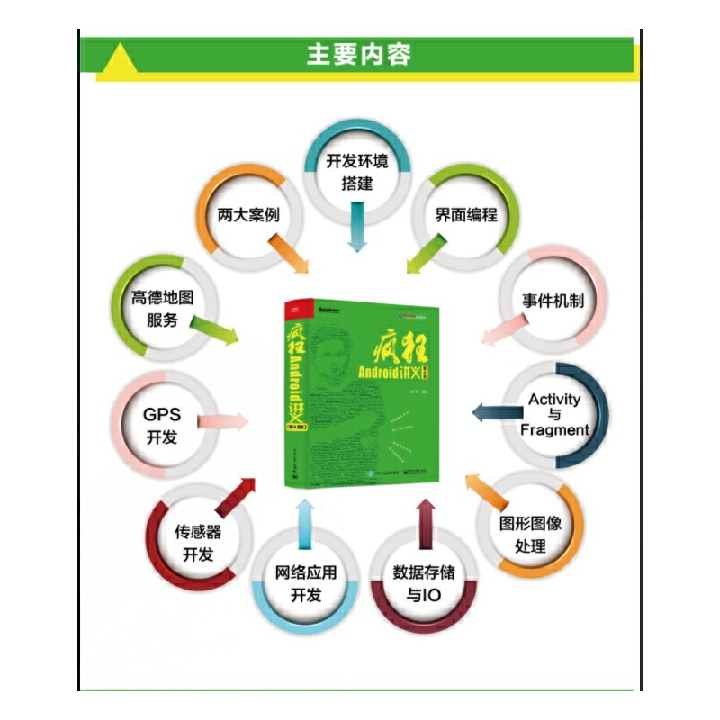

# 《疯狂Android讲义(第4版)》李刚(著)

## 书籍介绍

安卓经典之作基于Android9全新升级，stormzhang等圈内人士点赞，曾获评CSDN年度具有技术影响力十大原创图书，提供微信+QQ答疑群

| 书名：疯狂Android讲义（第4版） | 出版社：电子工业出版社 |
| ------------------------------ | ---------------------- |
| 出版时间：2019-03-01           | 版次：4                |
| 品牌：博文视点                 | ISBN：9787121360091    |
| 页数：764                      | 字数：1483000          |
| 包装：平装                     | 用纸：胶版纸           |

## 编辑推荐

适读人群 ：Android App开发人员

《疯狂Android讲义》自面市以来重印30+次，发行量近20万册，并屡获殊荣！

开卷数据显示《疯狂Android讲义》曾位列Android图书年度排行榜三甲

《疯狂Android讲义》曾获评CSDN年度具有技术影响力十大原创图书

青年意见领袖StormZhang及多部Android牛书作者刘望舒、柯俊林、启舰联合力荐

多次荣获电子工业出版社年度畅销图书及长销图书大奖

被工信出版集团授予年度“优秀出版物”奖

## 内容简介

　　《疯狂Android讲义（第4版）》基于最新的Android 版本，并采用Google推荐的IDE：Android Studio作为开发工具，书中每个案例、每个截图都全面升级x。本书全面介绍Android应用开发的相关知识，全书内容覆盖了Android用户界面编程、Android四大组件、Android资源访问、图形/图像处理、事件处理机制、Android输入/输出处理、音频/视频多媒体应用开发、OpenGL与3D应用开发、网络通信编程、Android整合RESTful服务端、传感器应用开发、GPS应用开发、整合第三方Map服务等。本书并不局限于介绍Android编程的各种理论知识，而是从"项目驱动”的角度来讲授理论。全书一共包括近百个实例，这些示范性的实例既可帮助读者更好地理解各知识点在实际开发中的应用，也可供读者在实际开发时作为参考，拿来就用。本书最后还提供了两个实用的案例：合金弹头和电子拍卖系统Android客户端（基于主流的RESTful服务端），具有极高的参考价值。本书提供了微信学习交流群，作者本人入群。

## 目录

### 第1章 Android应用和开发环境 1

####  1.1 Android的发展和历史 2
+ 1.1.1 Android的发展和简介 2
+ 1.1.2 Android 9.x平台架构及特性 2

#### 1.2 使用Gradle自动化构建项目 5
+ 1.2.1 下载和安装Gradle 5
+ 1.2.2 Gradle构建文件和创建任务 6
+ 1.2.3 Gradle的属性定义 11
+ 1.2.4 增量式构建 13
+ 1.2.5 Gradle插件和java、application等插件 14
+ 1.2.6 依赖管理 16
+ 1.2.7 自定义任务 19
+ 1.2.8 自定义插件 21

####  1.3 搭建Android开发环境 23
+ 1.3.1 安装Android Studio 23
+ 1.3.2 下载和安装Android SDK 28
+ 1.3.3 在安装过程中常见的错误 30
+ 1.3.4 安装运行、调试环境 31

#### 1.4 Android常用开发工具的用法 38
+ 1.4.1 使用Monitor进行调试 38
+ 1.4.2 Android Debug Bridge（ADB）的用法 40
+ 1.4.3 使用mksdcard管理虚拟SD卡 41

#### 1.5 开始第一个Android应用 41
+ 1.5.1 使用Android Studio开发第一个Android应用 41
+ 1.5.2 通过Andorid Studio运行Android应用 44

#### 1.6 Android应用结构分析 45
+ 1.6.1 Android项目结构分析 45
+ 1.6.2 自动生成的R.java 48
+ 1.6.3 res目录说明 48
+ 1.6.4 Android应用的清单文件：AndroidManifest.xml 49
+ 1.6.5 应用程序权限说明 50

#### 1.7 Android应用的基本组件介绍 51
+ 1.7.1 Activity和View 51
+ 1.7.2 Service 52
+ 1.7.3 BroadcastReceiver 52
+ 1.7.4 ContentProvider 53
+ 1.7.5 Intent和IntentFilter 53

#### 1.8 使用Android 9来签名APK 54
+ 1.8.1 使用Android Studio对Android应用签名 54
+ 1.8.2 使用Android 9的命令对APK签名 56

#### 1.9 本章小结 57

### 第2章 Android应用的界面编程 58
#### 2.1 界面编程与视图（View）组件 59
+ 2.1.1 视图组件与容器组件 59
+ 2.1.2 使用XML布局文件控制UI界面 65
+ 2.1.3 在代码中控制UI界面 65
+ 实例：用编程的方式开发UI界面 65
+ 2.1.4 使用XML布局文件和代码混合控制UI界面 67
+ 实例：简单图片浏览器 67
+ 2.1.5 开发自定义View 69
+ 实例：跟随手指的小球 69

#### 2.2 第1组UI组件：布局管理器 71
+ 2.2.1 线性布局 72
+ 2.2.2 表格布局 74
+ 实例：丰富的表格布局 74
+ 2.2.3 帧布局 76
+ 实例：霓虹灯效果 78
+ 2.2.4 绝对布局 79
+ 2.2.5 约束布局 80

#### 2.3 第2组UI组件：TextView及其子类 84
+ 2.3.1 文本框（TextView）和编辑框（EditText）的功能与用法 84
+ 实例：功能丰富的文本框 88
+ 2.3.2 EditText的功能与用法 90
+ 2.3.3 按钮（Button）组件的功能与用法 91
+ 实例：按钮、圆形按钮、带文字的图片按钮 91
+ 2.3.4 使用9Patch图片作为背景 92
+ 2.3.5 单选钮（RadioButton）和复选框（CheckBox）的功能与用法 94
+ 实例：利用单选钮、复选框获取用户信息 94
+ 2.3.6 状态开关按钮（ToggleButton）和开关（Switch）的功能与用法 96
+ 实例：动态控制布局 97
+ 2.3.7 时钟（AnalogClock和TextClock）的功能与用法 98
+ 实例：手机里的“劳力士” 98
+ 2.3.8 计时器（Chronometer） 99

#### 2.4 第3组UI组件：ImageView及其子类 100
+ 实例：图片浏览器 101
+ 实例：强大的图片按钮 104
+ 实例：使用QuickContactBadge关联联系人 105
+ 实例：可折叠的悬浮按钮 107

#### 2.5 第4组UI组件：AdapterView及子类 108
+ 2.5.1 Adapter接口及实现类 109
+ 实例：使用ArrayAdapter创建ListView 110
+ 实例：使用SimpleAdapter创建ListView 112
+ 2.5.2 自动完成文本框（AutoCompleteTextView）的功能与用法 114
+ 2.5.3 可展开的列表组件（ExpandableListView） 116
+ 2.5.4 Spinner的功能与用法 120
+ 2.5.5 AdapterViewFlipper的功能与用法 121
+ 实例：自动播放的图片库 122
+ 2.5.6 StackView的功能与用法 124
+ 实例：叠在一起的图片 125
+ 2.5.7 优秀的RecyclerView组件 126
+ 实例：使用RecyclerView实现列表 127

#### 2.6 第5组UI组件：ProgressBar及其子类 130
+ 2.6.1 进度条（ProgressBar）的功能与用法 130
+ 2.6.2 拖动条（SeekBar）的功能与用法 133
+ 实例：通过拖动滑块来改变图片的透明度 134
+ 2.6.3 星级评分条（RatingBar）的功能与用法 135
+ 实例：通过星级改变图片的透明度 136

#### 2.7 第6组UI组件：ViewAnimator及其子类 136
+ 2.7.1 ViewSwitcher的功能与用法 137
+ 实例：仿Android系统的Launcher界面 137
+ 2.7.2 图像切换器（ImageSwitcher）的功能与用法 142
+ 实例：支持动画的图片浏览器 142
+ 2.7.3 文本切换器（TextSwitcher）的功能与用法 144
+ 2.7.4 ViewFlipper的功能与用法 145
+ 实例：自动播放的图片库 145

#### 2.8 各种杂项组件 147
+ 2.8.1 使用Toast显示提示信息框 147
+ 实例：带图片的消息提示 147
+ 2.8.2 日历视图（CalendarView）组件的功能与用法 149
+ 实例：选择您的生日 149
+ 2.8.3 日期、时间选择器（DatePicker和TimePicker）的功能与用法 151
+ 实例：用户选择日期、时间 151
+ 2.8.4 数值选择器（NumberPicker）的功能与用法 153
+ 实例：选择您意向的价格范围 153
+ 2.8.5 搜索框（SearchView）的功能与用法 155
+ 实例：搜索 155
+ 2.8.6 滚动视图（ScrollView）的功能与用法 157
+ 实例：可垂直和水平滚动的视图 157
+ 2.8.7 Android 9 改进的通知和通知Channel 158
+ 实例：加薪通知 159

#### 2.9 第7组UI组件：对话框 161
+ 2.9.1 使用AlertDialog创建对话框 162
+ 实例：显示提示消息的对话框 162
+ 实例：简单列表项对话框 163
+ 实例：单选列表项对话框 164
+ 实例：多选列表项对话框 165
+ 实例：自定义列表项对话框 166
+ 实例：自定义View对话框 166
+ 2.9.2 对话框风格的窗口 168
+ 2.9.3 使用PopupWindow 168
+ 2.9.4 使用DatePickerDialog、TimePickerDialog 169
+ 2.9.5 使用ProgressDialog创建进度对话框 171

#### 2.10 菜单 171
+ 2.10.1 选项菜单和子菜单（SubMenu） 171
+ 2.10.2 使用监听器来监听菜单事件 175
+ 2.10.3 创建多选菜单项和单选菜单项 175
+ 2.10.4 设置与菜单项关联的Activity 175
+ 2.10.5 上下文菜单 176
+ 2.10.6 使用XML文件定义菜单 177
+ 实例：使用XML资源文件定义菜单 178
+ 2.10.7 使用PopupMenu创建弹出式菜单 181

#### 2.11 使用活动条（ActionBar） 182
+ 2.11.1 启用ActionBar 182
+ 2.11.2 使用ActionBar显示选项菜单项 183
+ 2.11.3 启用程序图标导航 185
+ 2.11.4 添加Action View 186
+ 实例：“标题”上的时钟 187

#### 2.12 本章小结 187

### 第3章 Android事件机制 188

#### 3.1 Android事件处理概述 189

#### 3.2 基于监听的事件处理 189
+ 3.2.1 监听的处理模型 189
+ 3.2.2 事件和事件监听器 192
+ 实例：控制飞机移动 192
+ 3.2.3 内部类作为事件监听器类 194
+ 3.2.4 外部类作为事件监听器类 194
+ 3.2.5 Activity本身作为事件监听器类 196
+ 3.2.6 Lambda表达式作为事件监听器类 196
+ 3.2.7 直接绑定到标签 197

#### 3.3 基于回调的事件处理 198
+ 3.3.1 回调机制与监听机制 198
+ 3.3.2 基于回调的事件传播 199

#### 3.4 响应系统设置的事件 201
+ 3.4.1 Configuration类简介 201
+ 实例：获取系统设备状态 202
+ 3.4.2 重写onConfigurationChanged方法响应系统设置更改 203
+ 实例：监听屏幕方向的改变 203

#### 3.5 Handler消息传递机制 205
+ 3.5.1 Handler类简介 205
+ 实例：自动播放动画 206
+ 3.5.2 Handler、Loop、MessageQueue的工作原理 207
+ 实例：使用新线程计算质数 208

#### 3.6 异步任务（AsyncTask） 210
+ 实例：使用异步任务执行下载 211

#### 3.7 本章小结 213

### 第4章 深入理解Activity与Fragment 214

#### 4.1 建立、配置和使用Activity 215
+ 4.1.1 高级Activity 215
+ 实例：用LauncherActivity开发启动Activity的列表 216
+ 实例：使用ExpandableListActivity实现可展开的Activity 217
+ 实例：PreferenceActivity结合PreferenceFragment实现参数设置界面 217
+ 4.1.2 配置Activity 222
+ 4.1.3 启动、关闭Activity 224
+ 4.1.4 使用Bundle在Activity之间交换数据 226
+ 实例：用第二个Activity处理注册信息 226
+ 4.1.5 启动其他Activity并返回结果 229
+ 实例：用第二个Activity让用户选择信息 230

#### 4.2 Activity的回调机制 232

#### 4.3 Activity的生命周期 233
+ 4.3.1 Activity的生命周期演示 233
+ 4.3.2 Activity与Servlet的相似性和区别 236

#### 4.4 Activity的4种加载模式 237
+ 4.4.1 standard模式 237
+ 4.4.2 singleTop模式 238
+ 4.4.3 singleTask模式 239
+ 4.4.4 singleInstance模式 240

#### 4.5 Android 9升级的Fragment 242
+ 4.5.1 Fragment概述及其设计初衷 242
+ 4.5.2 创建Fragment 243
+ 实例：开发显示图书详情的Fragment 244
+ 实例：创建ListFragment 246
+ 4.5.3 Fragment与Activity通信 247
+ 4.5.4 Fragment管理与Fragment事务 249
+ 实例：开发兼顾屏幕分辨率的应用 250

#### 4.6 Fragment的生命周期 253

#### 4.7 管理Fragment导航 257
+ 实例：结合ViewPager实现分页导航 257
+ 实例：结合TabLayout实现Tab导航 259

#### 4.7 本章小结 261

### 第5章 使用Intent和IntentFilter通信 262

#### 5.1 Intent对象简述 263

#### 5.2 Intent的属性及intent-filter配置 264
+ 5.2.1 Component属性 264
+ 5.2.2 Action、Category属性与intent-filter配置 266
+ 5.2.3 指定Action、Category调用系统Activity 270
+ 实例：查看并获取联系人电话 271
+ 实例：返回系统Home桌面 274
+ 5.2.4 Data、Type属性与intent-filter配置 274
+ 实例：使用Action、Data属性启动系统Activity 280
+ 5.2.5 Extra属性 282
+ 5.2.6 Flag属性 282

#### 5.3 本章小结 283

### 第6章 Android应用资源 284
#### 6.1 应用资源概述 285
+ 6.1.1 资源的类型及存储方式 285
+ 6.1.2 使用资源 286

#### 6.2 字符串、颜色、尺寸资源 288
+ 6.2.1 颜色值的定义 288
+ 6.2.2 定义字符串、颜色、尺寸资源文件 288
+ 6.2.3 使用字符串、颜色、尺寸资源 290

#### 6.3 数组（Array）资源 292
#### 6.4 使用Drawable资源 295
+ 6.4.1 图片资源 295
+ 6.4.2 StateListDrawable资源 295
+ 实例：高亮显示正在输入的文本框 296
+ 6.4.3 LayerDrawable资源 297
+ 实例：定制拖动条的外观 297
+ 6.4.4 ShapeDrawable资源 299
+ 实例：椭圆形、渐变背景的文本框 299
+ 6.4.5 ClipDrawable资源 301
+ 实例：徐徐展开的风景 301
+ 6.4.6 AnimationDrawable资源 302

#### 6.5 属性动画（Property Animation）资源 305
+ 实例：不断渐变的背景色 306

#### 6.6 使用原始XML资源 306
+ 6.6.1 定义原始XML资源 307
+ 6.6.2 使用原始XML文件 307

#### 6.7 使用布局（Layout）资源 309

#### 6.8 使用菜单（Menu）资源 309
#### 6.9 样式（Style）和主题（Theme）资源 309
+ 6.9.1 样式资源 310
+ 6.9.2 主题资源 311
+ 实例：给所有窗口添加边框、背景 311

#### 6.10 属性（Attribute）资源 313
#### 6.11 使用原始资源 315
#### 6.12 国际化 316
+ 6.12.1 为Android应用提供国际化资源 317
+ 6.12.2 国际化Android应用 317

#### 6.13 自适应不同屏幕的资源 319
#### 6.14 本章小结 322

### 第7章 图形与图像处理 323
#### 7.1 使用简单图片 324
+ 7.1.1 使用Drawable对象 324
+ 7.1.2 Bitmap和BitmapFactory 324
+ 7.1.3 Android 9新增的ImageDecoder 326

#### 7.2 绘图 328
+ 7.2.1 Android绘图基础：Canvas、Paint等 328
+ 7.2.2 Path类 332
+ 7.2.3 绘制游戏动画 335
+ 实例：采用双缓冲实现画图板 335
+ 实例：弹球游戏 339

#### 7.3 图形特效处理 342
+ 7.3.1 使用Matrix控制变换 342
+ 7.3.2 使用drawBitmapMesh扭曲图像 344
+ 实例：可揉动的图片 345
+ 7.3.3 使用Shader填充图形 347

#### 7.4 逐帧（Frame）动画 349
+ 7.4.1 AnimationDrawable与逐帧动画 349
+ 7.4.2 实例：在指定点爆炸 350

#### 7.5 补间（Tween）动画 352
+ 7.5.1 Tween动画与Interpolator 352
+ 7.5.2 位置、大小、旋转度、透明度改变的补间动画 354
+ 实例：蝴蝶飞舞 356
+ 7.5.3 自定义补间动画 358

#### 7.6 Android 8增强的属性动画 360
+ 7.6.1 属性动画的API 361
+ 7.6.2 使用属性动画 362
+ 实例：大珠小珠落玉盘 366

#### 7.7 使用SurfaceView实现动画 371
+ 7.7.1 SurfaceView的绘图机制 371
+ 7.7.2 实例：基于SurfaceView开发示波器 374

#### 7.8 本章小结 376

### 第8章 Android数据存储与IO 377
#### 8.1 使用SharedPreferences 378
+ 8.1.1 SharedPreferences与Editor简介 378
+ 8.1.2 SharedPreferences的存储位置和格式 379
+ 实例：记录应用程序的使用次数 380

#### 8.2 File存储 381
+ 8.2.1 openFileOutput和openFileInput 381
+ 8.2.2 读写SD卡上的文件 383
+ 实例：SD卡文件浏览器 386

#### 8.3 SQLite数据库 389
+ 8.3.1 SQLiteDatabase简介 390
+ 8.3.2 创建数据库和表 391
+ 8.3.3 SQLiteOpenHelper类 391
+ 8.3.4 使用SQL语句操作SQLite数据库 393
+ 8.3.5 使用sqlite3工具 396
+ 8.3.6 使用特定方法操作SQLite数据库 397
+ 8.3.7 事务 400
+ 8.3.8 SQLite数据库最佳实践建议 400

#### 8.4 手势（Gesture） 401
+ 8.4.1 手势检测 401
+ 实例：通过手势缩放图片 403
+ 实例：通过多点触碰缩放TextView 404
+ 实例：通过多点触碰缩放图片 406
+ 实例：通过手势实现翻页效果 408
+ 8.4.2 增加手势 410
+ 8.4.3 识别用户手势 413

#### 8.5 让应用说话（TTS） 415
#### 8.6 本章小结 418

### 第9章 使用ContentProvider实现数据共享 419
#### 9.1 数据共享标准：ContentProvider 420
+ 9.1.1 ContentProvider简介 420
+ 9.1.2 Uri简介 421
+ 9.1.3 使用ContentResolver操作数据 422

#### 9.2 开发ContentProvider 423
+ 9.2.1 ContentProvider与ContentResolver的关系 423
+ 9.2.2 开发ContentProvider子类 424
+ 9.2.3 配置ContentProvider 425
+ 9.2.4 使用ContentResolver调用方法 426
+ 9.2.5 创建ContentProvider的说明 428
+ 实例：使用ContentProvider共享单词数据 429

#### 9.3 操作系统的ContentProvider 434
+ 9.3.1 使用ContentProvider管理联系人 434
+ 9.3.2 使用ContentProvider管理多媒体内容 440

#### 9.4 监听ContentProvider的数据改变 443
+ 9.4.1 ContentObserver简介 443
+ 9.4.2 实例：监听用户发出的短信 444

#### 9.5 本章小结 446

### 第10章 Service和BroadcastReceiver 447
#### 10.1 Service简介 448
+ 10.1.1 创建、配置Service 448
+ 10.1.2 启动和停止Service 450
+ 10.1.3 绑定本地Service并与之通信 451
+ 10.1.4 Service的生命周期 454
+ 10.1.5 使用IntentService 455

#### 10.2 跨进程调用Service（AIDL Service） 458
+ 10.2.1 AIDL Service简介 458
+ 10.2.2 创建AIDL文件 459
+ 10.2.3 将接口暴露给客户端 459
+ 10.2.4 客户端访问AIDL Service 461
+ 实例：传递复杂数据的AIDL Service 462

#### 10.3 电话管理器（TelephonyManager） 467
+ 实例：获取网络和SIM卡信息 467
+ 实例：监听手机来电 469

#### 10.4 短信管理器（SmsManager） 470
+ 实例：发送短信 470
+ 实例：短信群发 471

#### 10.5 音频管理器（AudioManager） 474
+ 10.5.1 AudioManager简介 474
+ 10.5.2 实例：使用AudioManager控制手机音频 474

#### 10.6 振动器（Vibrator） 476
+ 10.6.1 Vibrator简介 476
+ 10.6.2 使用Vibrator控制手机振动 476

#### 10.7 手机闹钟服务（AlarmManager） 477
+ 10.7.1 AlarmManager简介 477
+ 10.7.2 设置闹钟 478

#### 10.8 广播接收器 480
+ 10.8.1 BroadcastReceiver简介 480
+ 10.8.2 发送广播 481
+ 10.8.3 有序广播 483
+ 实例：基于Service的音乐播放器 485

#### 10.9 接收系统广播消息 489
+ 实例：开机自动运行的Activity 490
+ 实例：手机电量提示 490
#### 10.10 本章小结 492

### 第11章 多媒体应用开发 493
#### 11.1 音频和视频的播放 494
+ 11.1.1 Android 9增强的MediaPlayer 494
+ 11.1.2 音乐特效控制 498
+ 实例：音乐的示波器、均衡、重低音和音场 499
+ 11.1.3 使用VolumeShaper控制声音效果 505
+ 11.1.4 使用SoundPool播放音效 507
+ 11.1.5 使用VideoView播放视频 509
+ 11.1.6 使用MediaPlayer和SurfaceView播放视频 511

#### 11.2 使用MediaRecorder录制音频 514
+ 实例：录制音乐 515

#### 11.3 控制摄像头拍照 517
+ 11.3.1 Android 9改进的Camera v2 517
+ 实例：拍照时自动对焦 518
+ 11.3.2 录制视频短片 526
+ 实例：录制生活短片 527

#### 11.4 屏幕捕捉 530
#### 11.5 本章小结 532

### 第12章 OpenGL与3D开发 533
#### 12.1 3D图形与3D开发的基本知识 534
#### 12.2 OpenGL和OpenGL ES简介 535
#### 12.3 绘制2D图形 536
+ 12.3.1 在Android应用中使用OpenGL ES 536
+ 12.3.2 绘制平面上的多边形 538
+ 12.3.3 旋转 543

#### 12.4 绘制3D图形 546
+ 12.4.1 构建3D图形 546
+ 12.4.2 应用纹理贴图 550

#### 12.5 本章小结 555

### 第13章 Android网络应用 556
#### 13.1 基于TCP协议的网络通信 557
+ 13.1.1 TCP协议基础 557
+ 13.1.2 使用ServerSocket创建TCP服务器端 558
+ 13.1.3 使用Socket进行通信 559
+ 13.1.4 加入多线程 562

#### 13.2 使用URL访问网络资源 567
+ 13.2.1 Android 9安全增强的URL 568
+ 13.2.2 使用URLConnection提交请求 570

#### 13.3 使用HTTP访问网络 575
+ 13.3.1 使用HttpURLConnection 575
+ 实例：多线程下载 576
+ 13.3.2 使用OkHttp 580
+ 实例：访问被保护资源 581

#### 13.4 使用WebView进行混合开发 585
+ 13.4.1 使用WebView浏览网页 586
+ 实例：迷你浏览器 586
+ 13.4.2 使用WebView加载HTML代码 587
+ 13.4.3 使用WebView中的JavaScript调用Android方法 588

#### 13.5 本章小结 591

### 第14章 管理Android系统桌面 592
#### 14.1 改变壁纸 593
+ 14.1.1 开发动态壁纸（Live Wallpapers） 593
+ 14.1.2 实例：蜿蜒壁纸 594

#### 14.2 快捷方式 597
+ 14.2.1 静态快捷方式 598
+ 14.2.2 动态快捷方式 599
+ 14.2.3 桌面快捷方式（Pinned Shortcut） 601
+ 实例：让程序占领桌面 601

#### 14.3 管理桌面控件 602
+ 14.3.1 开发桌面控件 602
+ 实例：液晶时钟 604
+ 14.3.2 显示带数据集的桌面控件 606

#### 14.4 本章小结 610

### 第15章 传感器应用开发 611
#### 15.1 利用Android的传感器 612
#### 15.2 Android的常用传感器 614
+ 15.2.1 方向传感器 614
+ 15.2.2 陀螺仪传感器 615
+ 15.2.3 磁场传感器 615
+ 15.2.4 重力传感器 615
+ 15.2.5 线性加速度传感器 615
+ 15.2.6 温度传感器 616
+ 15.2.7 光传感器 616
+ 15.2.8 湿度传感器 616
+ 15.2.9 压力传感器 616
+ 15.2.10 心率传感器 616
+ 15.2.11 离身检查传感器 616

#### 15.3 传感器应用案例 620
+ 实例：指南针 620
+ 实例：水平仪 621

#### 15.4 本章小结 625

### 第16章 GPS应用开发 626
#### 16.1 支持GPS的核心API 627
#### 16.2 获取LocationProvider 628
+ 16.2.1 获取所有可用的LocationProvider 629
+ 16.2.2 通过名称获得指定LocationProvider 629

#### 16.3 获取定位信息 630
+ 16.3.1 通过模拟器发送GPS信息 630
+ 16.3.2 获取定位数据 630
+ 16.3.3 Android 9新增的室内Wi-Fi定位 632

#### 16.4 临近警告 634
#### 16.5 本章小结 636

### 第17章 整合高德Map服务 637
#### 17.1 调用高德Map服务 638
+ 17.1.1 获取Map API Key 638
+ 17.1.2 高德地图入门 640

#### 17.2 根据GPS信息在地图上定位 643
#### 17.3 实际定位 649
+ 17.3.1 地址解析与反向地址解析 649
+ 17.3.2 根据地址执行定位 652

#### 17.4 GPS导航 654
#### 17.5 本章小结 659

### 第18章 合金弹头 660
#### 18.1 合金弹头游戏简介 661
#### 18.2 开发游戏界面组件 661
+ 18.2.1 游戏界面分析 662
+ 18.2.2 实现“怪物”类 662
+ 18.2.3 实现怪物管理类 669
+ 18.2.4 实现“子弹”类 673
+ 18.2.5 实现“角色”类 676

#### 18.3 实现绘图工具类 681
#### 18.4 加载、管理游戏图片 686
#### 18.5 实现游戏界面 689
+ 18.5.1 实现游戏Activity 689
+ 18.5.2 实现主视图 691

#### 18.6 本章小结 699

### 第19章 电子拍卖系统 700
#### 19.1 系统功能简介和架构设计 701
+ 19.1.1 系统功能简介 701
+ 19.1.2 系统架构设计 702

#### 19.2 JSON简介 703
+ 19.2.1 使用JSON语法创建对象 704
+ 19.2.2 使用JSON语法创建数组 705
+ 19.2.3 Android的JSON支持 706

#### 19.3 发送请求的工具类 706
#### 19.4 用户登录 708
+ 19.4.1 处理登录的接口 708
+ 19.4.2 用户登录客户端 708

#### 19.5 查看流拍物品 716
+ 19.5.1 查看流拍物品的接口 716
+ 19.5.2 查看流拍物品客户端 717

#### 19.6 管理物品种类 722
+ 19.6.1 浏览物品种类的接口 722
+ 19.6.2 查看物品种类 723
+ 19.6.3 添加物品种类的接口 727
+ 19.6.4 添加物品种类 727

#### 19.7 管理拍卖物品 729
+ 19.7.1 查看自己的拍卖物品的接口 729
+ 19.7.2 查看自己的拍卖物品 729
+ 19.7.3 添加拍卖物品的接口 733
+ 19.7.4 添加拍卖物品 733

#### 19.8 参与竞拍 738
+ 19.8.1 选择物品种类 738
+ 19.8.2 根据种类浏览物品的服务器端接口 740
+ 19.8.3 根据种类浏览物品 740
+ 19.8.4 参与竞价的服务器端接口 742
+ 19.8.5 参与竞价 742

#### 19.9 权限控制 747
#### 19.10 本章小结 748