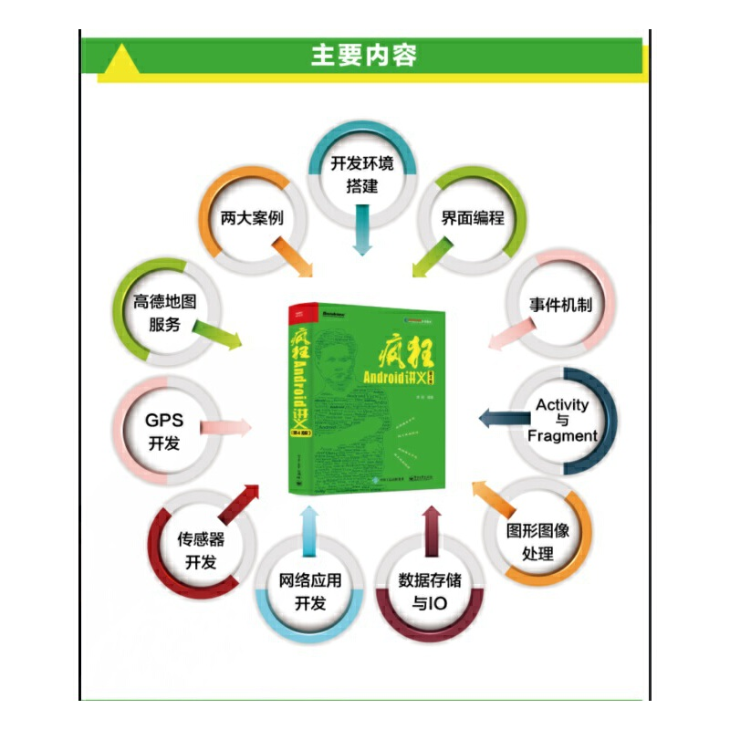

# 《疯狂Android讲义(第4版)》李刚(著)

## 书籍介绍

安卓经典之作基于Android9全新升级，stormzhang等圈内人士点赞，曾获评CSDN年度具有技术影响力十大原创图书，提供微信+QQ答疑群

| 书名：疯狂Android讲义（第4版） | 出版社：电子工业出版社 |
| ------------------------------ | ---------------------- |
| 出版时间：2019-03-01           | 版次：4                |
| 品牌：博文视点                 | ISBN：9787121360091    |
| 页数：764                      | 字数：1483000          |
| 包装：平装                     | 用纸：胶版纸           |

## 编辑推荐

适读人群 ：Android App开发人员

《疯狂Android讲义》自面市以来重印30+次，发行量近20万册，并屡获殊荣！

开卷数据显示《疯狂Android讲义》曾位列Android图书年度排行榜三甲

《疯狂Android讲义》曾获评CSDN年度具有技术影响力十大原创图书

青年意见领袖StormZhang及多部Android牛书作者刘望舒、柯俊林、启舰联合力荐

多次荣获电子工业出版社年度畅销图书及长销图书大奖

被工信出版集团授予年度“优秀出版物”奖

## 内容简介

　　《疯狂Android讲义（第4版）》基于最新的Android 版本，并采用Google推荐的IDE：Android Studio作为开发工具，书中每个案例、每个截图都全面升级x。本书全面介绍Android应用开发的相关知识，全书内容覆盖了Android用户界面编程、Android四大组件、Android资源访问、图形/图像处理、事件处理机制、Android输入/输出处理、音频/视频多媒体应用开发、OpenGL与3D应用开发、网络通信编程、Android整合RESTful服务端、传感器应用开发、GPS应用开发、整合第三方Map服务等。本书并不局限于介绍Android编程的各种理论知识，而是从"项目驱动”的角度来讲授理论。全书一共包括近百个实例，这些示范性的实例既可帮助读者更好地理解各知识点在实际开发中的应用，也可供读者在实际开发时作为参考，拿来就用。本书最后还提供了两个实用的案例：合金弹头和电子拍卖系统Android客户端（基于主流的RESTful服务端），具有极高的参考价值。本书提供了微信学习交流群，作者本人入群。

## 目录

### 第1章　Android应用和开发环境 1

1.1　Android的发展和历史 2

1.2　使用Gradle自动化构建项目 5

1.3　搭建Android开发环境 23

1.4　Android常用开发工具的用法 38

1.5　开始第一个Android应用 41

1.6　Android应用结构分析 45

1.7　Android应用的基本组件介绍 51

1.8　使用Android 来签名APK 54

1.9　本章小结 57

### 第2章　Android应用的界面编程 58

2.1　界面编程与视图（View）组件 59

2.1.1　视图组件与容器组件 59

2.1.2　使用XML布局文件控制UI界面 65

2.1.3　在代码中控制UI界面 65

实例：用编程的方式开发UI界面 65

2.1.4　使用XML布局文件和代码混合控制UI界面 67

实例：简单图片浏览器 67

2.1.5　开发自定义View 69

实例：跟随手指的小球 69

2.2　第1组UI组件：布局管理器 71

2.2.1　线性布局 72

2.2.2　表格布局 74

实例：丰富的表格布局 74

2.2.3　帧布局 76

实例：霓虹灯效果 78

2.2.4　绝对布局 79

2.2.5　约束布局 80

2.3　第2组UI组件：TextView及其子类 84

2.3.1　文本框（TextView）和编辑框（EditText）的功能与用法 84

实例：功能丰富的文本框 88

2.3.2　EditText的功能与用法 90

2.3.3　按钮（Button）组件的功能与用法 91

实例：按钮、圆形按钮、带文字的图片按钮 91

2.3.4　使用9Patch图片作为背景 92

2.3.5　单选钮（RadioButton）和复选框（CheckBox）的功能与用法 94

实例：利用单选钮、复选框获取用户信息 94

2.3.6　状态开关按钮（ToggleButton）和开关（Switch）的功能与用法 96

实例：动态控制布局 97

2.3.7　时钟（AnalogClock和TextClock）的功能与用法 98

实例：手机里的“劳力士” 98

2.3.8　计时器（Chronometer） 99

2.4　第3组UI组件：ImageView及其子类 100

实例：图片浏览器 101

实例：强大的图片按钮 104

实例：使用QuickContactBadge关联联系人 105

实例：可折叠的悬浮按钮 107

2.5　第4组UI组件：AdapterView及子类 108

2.5.1　Adapter接口及实现类 109

实例：使用ArrayAdapter创建ListView 110

实例：使用SimpleAdapter创建ListView 112

2.5.2　自动完成文本框（AutoCompleteTextView）的功能与用法 114

2.5.3　可展开的列表组件（ExpandableListView） 116

2.5.4　Spinner的功能与用法 120

2.5.5　AdapterViewFlipper的功能与用法 121

实例：自动播放的图片库 122

2.5.6　StackView的功能与用法 124

实例：叠在一起的图片 125

2.5.7　优秀的RecyclerView组件 126

实例：使用RecyclerView实现列表 127

2.6　第5组UI组件：ProgressBar及其子类 130

2.6.1　进度条（ProgressBar）的功能与用法 130

2.6.2　拖动条（SeekBar）的功能与用法 133

实例：通过拖动滑块来改变图片的透明度 134

2.6.3　星级评分条（RatingBar）的功能与用法 135

实例：通过星级改变图片的透明度 136

2.7　第6组UI组件：ViewAnimator及其子类 136

2.7.1　ViewSwitcher的功能与用法 137

实例：仿Android系统的Launcher界面 137

2.7.2　图像切换器（ImageSwitcher）的功能与用法 142

实例：支持动画的图片浏览器 142

2.7.3　文本切换器（TextSwitcher）的功能与用法 144

2.7.4　ViewFlipper的功能与用法 145

实例：自动播放的图片库 145

2.8　各种杂项组件 147

2.8.1　使用Toast显示提示信息框 147

实例：带图片的消息提示 147

2.8.2　日历视图（CalendarView）组件的功能与用法 149

实例：选择您的生日 149

2.8.3　日期、时间选择器（DatePicker和TimePicker）的功能与用法 151

实例：用户选择日期、时间 151

2.8.4　数值选择器（NumberPicker）的功能与用法 153

实例：选择您意向的价格范围 153

2.8.5　搜索框（SearchView）的功能与用法 155

实例：搜索 155

2.8.6　滚动视图（ScrollView）的功能与用法 157

实例：可垂直和水平滚动的视图 157

2.8.7　Android 9 改进的通知和通知Channel 158

实例：加薪通知 159

2.9　第7组UI组件：对话框 161

实例：显示提示消息的对话框 162

实例：简单列表项对话框 163

实例：单选列表项对话框 164

实例：多选列表项对话框 165

实例：自定义列表项对话框 166

实例：自定义View对话框 166

2.10　菜单 171

实例：使用XML资源文件定义菜单 178

2.11　使用活动条（ActionBar） 182

实例：“标题”上的时钟 187

2.12　本章小结 187

### 第3章　Android事件机制 188

3.1　Android事件处理概述 189

3.2　基于监听的事件处理 189

实例：控制飞机移动 192

3.3　基于回调的事件处理 198

3.4　响应系统设置的事件 201

实例：获取系统设备状态 202

实例：监听屏幕方向的改变 203

3.5　Handler消息传递机制 205

3.5.1　Handler类简介 205

实例：自动播放动画 206

3.5.2　Handler、Loop、MessageQueue的工作原理 207

实例：使用新线程计算质数 208

3.6　异步任务（AsyncTask） 210

实例：使用异步任务执行下载 211

3.7　本章小结 213

### 第4章　深入理解Activity与Fragment 214

4.1　建立、配置和使用Activity 215

4.1.1　高级Activity 215

实例：用LauncherActivity开发启动Activity的列表 216

实例：使用ExpandableListActivity实现

可展开的Activity 217

实例：PreferenceActivity结合

PreferenceFragment实现参数设置界面 217

4.1.2　配置Activity 222

4.1.3　启动、关闭Activity 224

4.1.4　使用Bundle在Activity之间交换数据 226

实例：用第二个Activity处理注册信息 226

4.1.5　启动其他Activity并返回结果 229

实例：用第二个Activity让用户选择信息 230

4.2　Activity的回调机制 232

4.3　Activity的生命周期 233

4.3.1　Activity的生命周期演示 233

4.3.2　Activity与Servlet的相似性和区别 236

4.4　Activity的4种加载模式 237

4.4.1　standard模式 237

4.4.2　singleTop模式 238

4.4.3　singleTask模式 239

4.4.4　singleInstance模式 240

4.5　Android 9升级的Fragment 242

4.5.1　Fragment概述及其设计初衷 242

4.5.2　创建Fragment 243

实例：开发显示图书详情的Fragment 244

实例：创建ListFragment 246

4.5.3　Fragment与Activity通信 247

4.5.4　Fragment管理与Fragment事务 249

实例：开发兼顾屏幕分辨率的应用 250

4.6　Fragment的生命周期 253

4.7　管理Fragment导航 257

实例：结合ViewPager实现分页导航 257

实例：结合TabLayout实现Tab导航 259

4.7　本章小结 261

### 第5章　使用Intent和IntentFilter通信 262

5.1　Intent对象简述 263

5.2　Intent的属性及intent-filter配置 264

5.2.1　Component属性 264

5.2.2　Action、Category属性与intent-filter配置 266

5.2.3　指定Action、Category调用系统Activity 270

实例：查看并获取联系人电话 271

实例：返回系统Home桌面 274

5.2.4　Data、Type属性与intent-filter配置 274

实例：使用Action、Data属性启动系统Activity 280

5.2.5　Extra属性 282

5.2.6　Flag属性 282

5.3　本章小结 283

### 第6章　Android应用资源 284

6.1　应用资源概述 285

6.1.1　资源的类型及存储方式 285

6.1.2　使用资源 286

6.2　字符串、颜色、尺寸资源 288

6.2.1　颜色值的定义 288

6.2.2　定义字符串、颜色、尺寸资源文件 288

6.2.3　使用字符串、颜色、尺寸资源 290

6.3　数组（Array）资源 292

6.4　使用Drawable资源 295

6.4.1　图片资源 295

6.4.2　StateListDrawable资源 295

实例：高亮显示正在输入的文本框 296

6.4.3　LayerDrawable资源 297

实例：定制拖动条的外观 297

6.4.4　ShapeDrawable资源 299

实例：椭圆形、渐变背景的文本框 299

6.4.5　ClipDrawable资源 301

实例：徐徐展开的风景 301

6.4.6　AnimationDrawable资源 302

6.5　属性动画（Property Animation）资源 305

实例：不断渐变的背景色 306

6.6　使用原始XML资源 306

6.6.1　定义原始XML资源 307

6.6.2　使用原始XML文件 307

6.7　使用布局（Layout）资源 309

6.8　使用菜单（Menu）资源 309

6.9　样式（Style）和主题（Theme）资源 309

6.9.1　样式资源 310

6.9.2　主题资源 311

实例：给所有窗口添加边框、背景 311

6.10　属性（Attribute）资源 313

6.11　使用原始资源 315

6.12　国际化 316

6.12.1　为Android应用提供国际化资源 317

6.12.2　国际化Android应用 317

6.13　自适应不同屏幕的资源 319

6.14　本章小结 322

### 第7章　图形与图像处理 323

7.1　使用简单图片 324

7.1.1　使用Drawable对象 324

7.1.2　Bitmap和BitmapFactory 324

7.1.3　Android 9新增的ImageDecoder 326

7.2　绘图 328

7.2.1　Android绘图基础：Canvas、Paint等 328

7.2.2　Path类 332

7.2.3　绘制游戏动画 335

实例：采用双缓冲实现画图板 335

实例：弹球游戏 339

7.3　图形特效处理 342

7.3.1　使用Matrix控制变换 342

7.3.2　使用drawBitmapMesh扭曲图像 344

实例：可揉动的图片 345

7.3.3　使用Shader填充图形 347

7.4　逐帧（Frame）动画 349

7.4.1　AnimationDrawable与逐帧动画 349

7.4.2 实例：在指定点爆炸 350

7.5　补间（Tween）动画 352

7.5.1　Tween动画与Interpolator 352

7.5.2　位置、大小、旋转度、透明度改变的补间动画 354

实例：蝴蝶飞舞 356

7.5.3　自定义补间动画 358

7.6　Android 8增强的属性动画 360

7.6.1　属性动画的API 361

7.6.2　使用属性动画 362

实例：大珠小珠落玉盘 366

7.7　使用SurfaceView实现动画 371

7.7.1　SurfaceView的绘图机制 371

7.7.2　实例：基于SurfaceView开发示波器 374

7.8　本章小结 376

### 第8章　Android数据存储与IO 377

8.1　使用SharedPreferences 378

8.1.1　SharedPreferences与Editor简介 378

8.1.2　SharedPreferences的存储位置和格式 379

实例：记录应用程序的使用次数 380

8.2　File存储 381

8.2.1　openFileOutput和openFileInput 381

8.2.2　读写SD卡上的文件 383

实例：SD卡文件浏览器 386

8.3　SQLite数据库 389

8.4　手势（Gesture） 401

8.4.1　手势检测 401

实例：通过手势缩放图片 403

实例：通过多点触碰缩放TextView 404

实例：通过多点触碰缩放图片 406

实例：通过手势实现翻页效果 408

8.4.2　增加手势 410

8.4.3　识别用户手势 413

8.5　让应用说话（TTS） 415

8.6　本章小结 418

### 第9章　使用ContentProvider实现数据共享 419

9.1　数据共享标准：ContentProvider 420

9.2　开发ContentProvider 423

实例：使用ContentProvider共享单词数据 429

9.3　操作系统的ContentProvider 434

9.4　监听ContentProvider的数据改变 443

9.5　本章小结 446

### 第10章　Service和BroadcastReceiver 447

10.1　Service简介 448

10.2　跨进程调用Service（AIDL Service） 458

实例：传递复杂数据的AIDL Service 462

10.3　电话管理器（TelephonyManager） 467

实例：获取网络和SIM卡信息 467

实例：监听手机来电 469

10.4　短信管理器（SmsManager） 470

实例：发送短信 470

实例：短信群发 471

10.5　音频管理器（AudioManager） 474

10.6　振动器（Vibrator） 476

10.7　手机闹钟服务（AlarmManager） 477

10.8　广播接收器 480

实例：基于Service的音乐播放器 485

10.9　接收系统广播消息 489

实例：开机自动运行的Activity 490

实例：手机电量提示 490

10.10　本章小结 492

### 第11章　多媒体应用开发 493

### 第12章　OpenGL与3D开发 533

12.1 3D图形与3D开发的基本知识 534

12.2 OpenGL和OpenGL ES简介 535

12.3 绘制2D图形 536

12.4 绘制3D图形 546

12.5 本章小结 555

### 第13章　Android网络应用 556

### 第14章　管理Android系统桌面 592

### 第15章　传感器应用开发 611

### 第16章　GPS应用开发 626

### 第17章　整合高德Map服务 637

### 第18章　合金弹头 660

### 第19章　电子拍卖系统 700