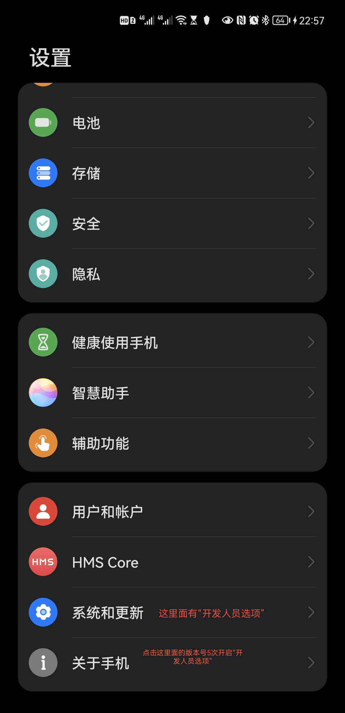
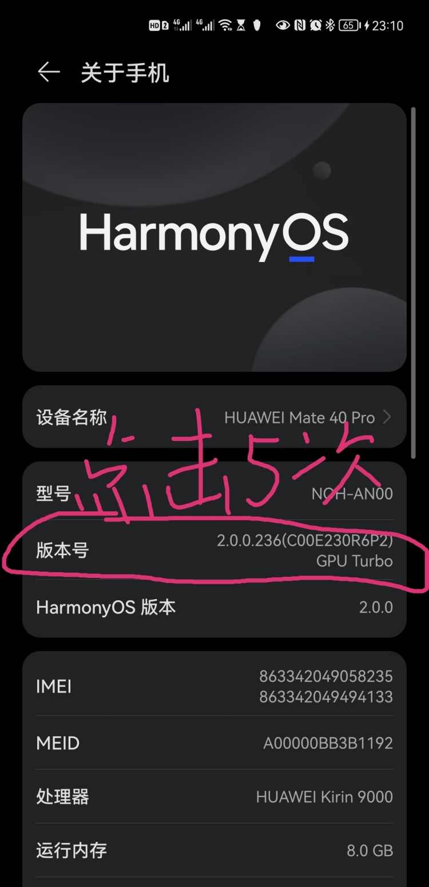
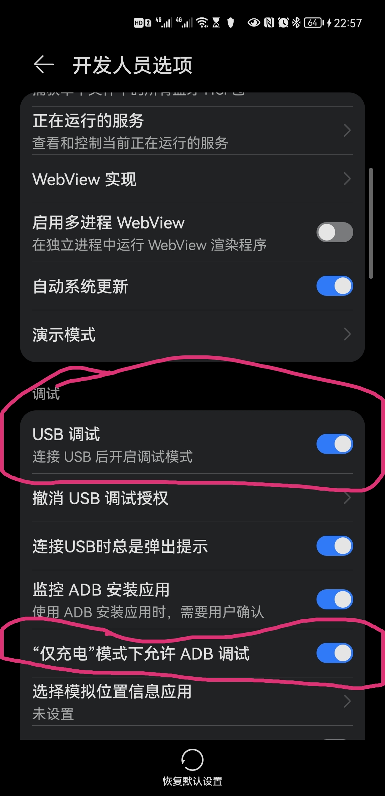
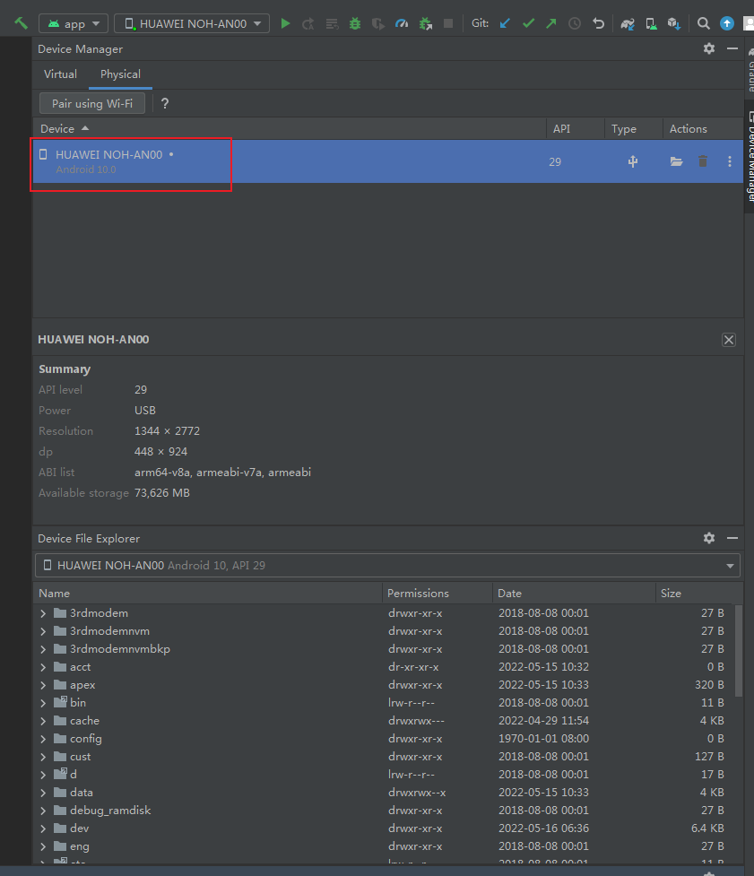

## mate40在Android Studio中用ADB调试

## 1.打开华为手机的开发者选项:

> 打开“设置”界面——>点击“系统”——>点击“关于手机”——>连续点击“版本号”，点击5次左右，直到手机提示已开启开发者模式
> 
>
> 点击版本号5次以上开启开发者选项
>
> 

## 2.打开开发人员选项

### 2.1 、打开“开发人员选项”

###  2.2、打开”USB调试“选项

### 2.3、打开“仅充电模式下允许ADB调试”选项。

如果不打开“仅充电模式下允许ADB调试”选项 导致AndroidStudio 连接不上华为手机，而且关闭开发人员选项页面再进来，会发现usb调试打开后自动关闭，打开“仅充电模式下允许ADB调试”选项就可以了！

## 最终效果如下

